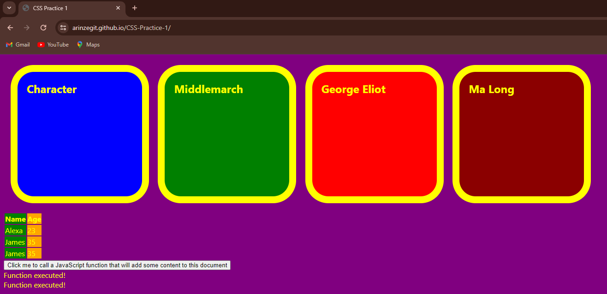

# CSS Practice 1

## Context and Description
This project contains elements that respond to hover and clicks of the mouse and can add text to the page by clicking. I did this project to implement some HTML/CSS/JS concepts I learned that respond to user interaction; Pseudo-class like 'hover' and 'active'and onclick attributes that can call a JavaScript function.
## How to run
* Ensure you have a modern web browser installed
* Open the index.html file in your web browser
* The project should now be visible in your browser
* You can also visit the live site URL [here](https://arinzegit.github.io/CSS-Practice-1/)
## Technologies used
* HTML
* CSS
* JavaScript
## Challenges faced during development
* None
